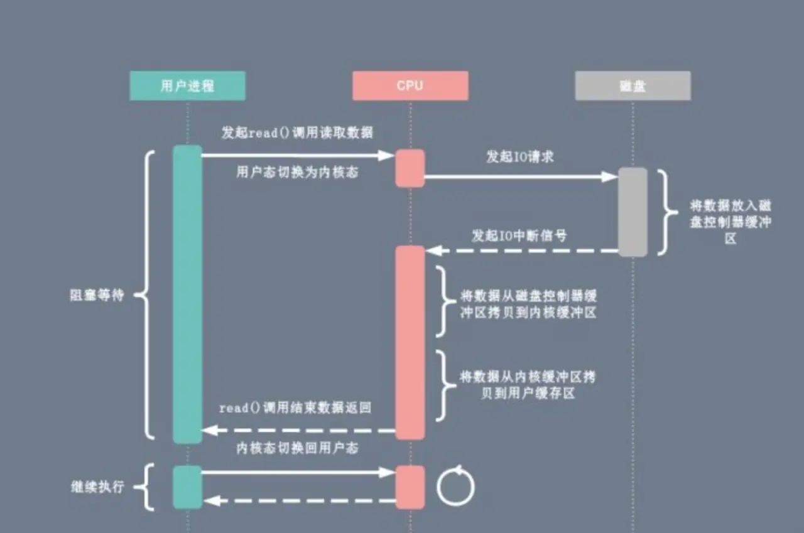
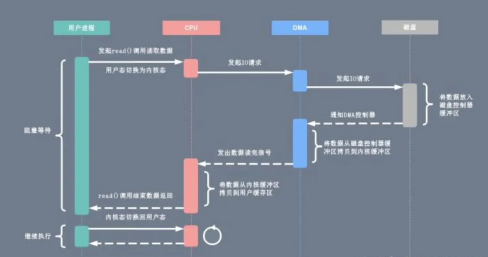
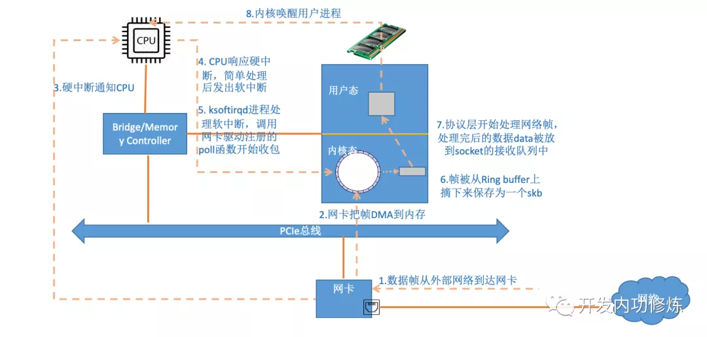

## 2.4 epoll API


在介绍select和epoll的基础上，需要对内核怎么从网卡上获取包的流程有一定的了解。

### 网卡获取包

现有网卡基本上都支持dma功能，即(direct memory access)直接内存存取，简单来说这个方式是用于将网卡或者其他硬件设备上的数据直接拷贝到内存中。大大了减轻了cpu的工作量，为什么会减少cpu的工作量，还得从最初的状态来介绍：

Linux提供了轮询、I/O中断以及DMA和RDMA等。


#### I/O轮询
对I/O设备的程序轮询的方式，是早期的计算机系统对I/O设备的一种管理方式。它定时对各种设备轮流询问一遍有无处理要求。轮流询问之后，有要求的，则加以处理。在处理I/O设备的要求之后，处理机返回继续工作。尽管轮询需要时间，但轮询比I/O设备的速度要快得多，所以一般不会发生不能及时处理的问题，I/O操作的时效性是可以保证的。但是处理器的速度再快，能处理的输入输出设备的数量也是有一定限度的。而且，程序轮询会占据CPU相当一部分处理时间，因此程序轮询是一种效率较低的方式，在现代计算机系统中已很少应用。


#### 中断方式的I/O处理

cpu自己负责数据从设备拷贝到内存中。

1. 在某个进程需要数据时，发出指令启动I/O设备准备数据
2. 在进程发出指令启动设备之后，将进程将从工作进程移除，变为等待进程，等待I/O设备处理完毕
3. 当I/O操作完成时，输入输出设备控制器通过中断请求向Cpu发送中断信号，处理器收到中断信号后，转向预先设计好的中断程序，对数据传送工作进行相应的处理
4. 数据准备完成后，os将阻塞的进程唤醒，将其转入就绪状态。 



1. 用户进程向 CPU 发起 read 系统调用读取数据，由用户态切换为内核态，然后一直阻塞等待数据的返回。（这段时间不会占用CPU时间片）
2. CPU 在接收到指令以后对磁盘发起 I/O 请求，将磁盘数据先放入磁盘控制器缓冲区。
3. 数据准备完成以后，磁盘向 CPU 发起 I/O 中断。
4. CPU 收到 I/O 中断以后将磁盘缓冲区中的数据拷贝到内核缓冲区，然后再从内核缓冲区拷贝到用户缓冲区。
5. 用户进程由内核态切换回用户态，解除阻塞状态，然后等待 CPU 的下一个执行时间钟。

#### DMA中断

DMA和上述基本一致，只是由DMA将数据从设备中拷贝到内存中。

DMA 传输则在 I/O 中断的基础上引入了 DMA 磁盘控制器，由 DMA 磁盘控制器负责数据的传输，降低了 I/O 中断操作对 CPU 资源的大量消耗。



1. 用户进程向 CPU 发起 read 系统调用读取数据，由用户态切换为内核态，然后一直阻塞等待数据的返回。
2. CPU 在接收到指令以后对 DMA 磁盘控制器发起调度指令。
3. DMA 磁盘控制器对磁盘发起 I/O 请求，将磁盘数据先放入磁盘控制器缓冲区，CPU 全程不参与此过程。
4. 数据读取完成后，DMA 磁盘控制器会接受到磁盘的通知，将数据从磁盘控制器缓冲区拷贝到内核缓冲区。
5. DMA 磁盘控制器向 CPU 发出数据读完的信号，由 CPU 负责将数据从内核缓冲区拷贝到用户缓冲区。
6. 用户进程由内核态切换回用户态，解除阻塞状态，然后等待 CPU 的下一个执行时间钟。


#### 网卡收包

补充一下概念
硬中断：目前理解硬中断，硬件发出，处理时间较短，由cpu处理硬中断，是cpu引脚电平的变化。
软中断：目前理解处理时间较长，由ksoftirqd进程处理软中断。



1. 当网卡收到数据以后，网络驱动会以DMA的方式把网卡收到的帧写到内存里。然后向CPU发送一个硬中断

### epoll select 网卡软中断，多路复用


2.4.1 创建EPOLL

```cpp
/**
 * @param size 告诉内核监听的数目
 *
 * @returns 返回一个epoll句柄（即一个文件描述符）
 */
int epoll_create(int size);
```

```cpp
int epfd = epoll_create(1000);
```


2.4.2 控制EPOLL

```cpp
/**
 * @param epfd 用epoll_create所创建的epoll句柄
 * @param op 表示对epoll监控描述符控制的动作
 *
 * EPOLL_CTL_ADD(注册新的fd到epfd)
 * EPOLL_CTL_MOD(修改已经注册的fd的监听事件)
 * EPOLL_CTL_DEL(epfd删除一个fd)
 *
 * @param fd 需要监听的文件描述符
 * @param event 告诉内核需要监听的事件
 *
 * @returns 成功返回0，失败返回-1, errno查看错误信息
 */
int epoll_ctl(int epfd, int op, int fd, 
            struct epoll_event *event);


struct epoll_event {
 __uint32_t events; /* epoll 事件 */
 epoll_data_t data; /* 用户传递的数据 */
}

/*
 * events : {EPOLLIN, EPOLLOUT, EPOLLPRI, 
            EPOLLHUP, EPOLLET, EPOLLONESHOT}
 */

typedef union epoll_data {
    void *ptr;
    int fd;
    uint32_t u32;
    uint64_t u64;
} epoll_data_t;

```

```cpp
struct epoll_event new_event;

new_event.events = EPOLLIN | EPOLLOUT;
new_event.data.fd = 5;

epoll_ctl(epfd, EPOLL_CTL_ADD, 5, &new_event);

```


2.4.3 等待EPOLL

```cpp

/**
 *
 * @param epfd 用epoll_create所创建的epoll句柄
 * @param event 从内核得到的事件集合
 * @param maxevents 告知内核这个events有多大,
 *             注意: 值 不能大于创建epoll_create()时的size.
 * @param timeout 超时时间
 *     -1: 永久阻塞
 *     0: 立即返回，非阻塞
 *     >0: 指定微秒
 *
 * @returns 成功: 有多少文件描述符就绪,时间到时返回0
 *          失败: -1, errno 查看错误
 */
int epoll_wait(int epfd, struct epoll_event *event, 
            int maxevents, int timeout);        

```


```cpp
struct epoll_event my_event[1000];

int event_cnt = epoll_wait(epfd, my_event, 1000, -1);

```


2.4.4 epoll编程框架

```cpp
//创建 epoll
int epfd = epoll_crete(1000);

//将 listen_fd 添加进 epoll 中
epoll_ctl(epfd, EPOLL_CTL_ADD, listen_fd,&listen_event);

while (1) {
    //阻塞等待 epoll 中 的fd 触发
    int active_cnt = epoll_wait(epfd, events, 1000, -1);

    for (i = 0 ; i < active_cnt; i++) {
        if (evnets[i].data.fd == listen_fd) {
            //accept. 并且将新accept 的fd 加进epoll中.
        }
        else if (events[i].events & EPOLLIN) {
            //对此fd 进行读操作
        }
        else if (events[i].events & EPOLLOUT) {
            //对此fd 进行写操作
        }
    }
}
```


